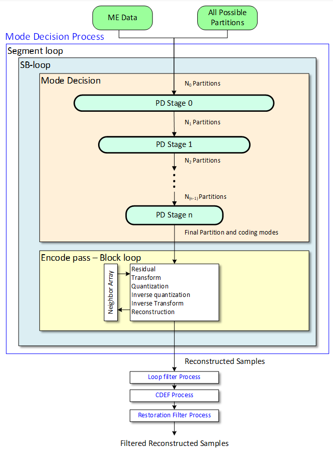
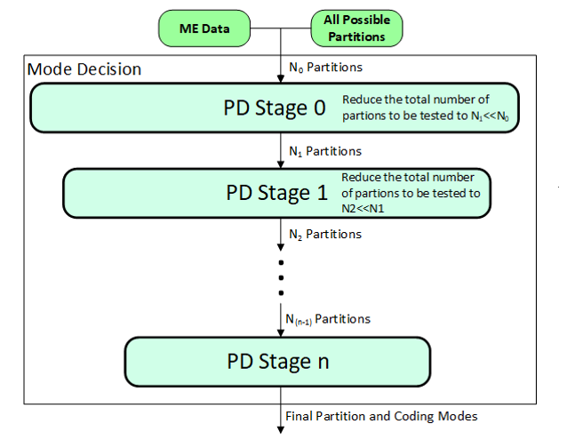
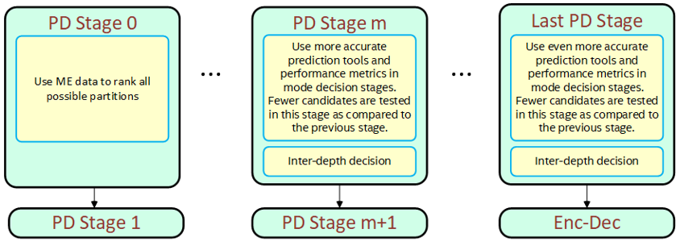

[Top level](../README.md)

# Mode Decision and Encode Pass Appendix

## High Level Description

The Mode Decision process encapsulates the partitioning decision, mode
decisions, and conformant AV1 encoding. The partitioning decision (PD) stages
output the final partitioning of each SB, along with the final mode decision
for each block. Mode decision (MD) happens within each PD stage and is where
many of the encoder tasks such as Intra Prediction, Motion Compensated
Prediction, Transform, and Quantization are performed. Finally, the final
partitioning and mode decisions are passed to the Encode Pass, where conformant
reconstructed samples are generated and final mode info is stored, to be passed
to in-loop filters and entropy coding. The flow of the Mode Decision process is
summarized in Figure 1.

The Mode Decision process takes as input the motion vector and distortion
estimations from the Motion Estimation process and the picture-level QP from
the Rate Control process. The Mode Decision process operates on an SB basis
(i.e. each step in the Mode Decision process is performed for each SB).



##### Figure 1. Partitioning, mode decision, encoding and filtering tasks.

### Partitioning Decision

Given the large number of block sizes and the large number of modes that could
be considered for each block, it would be computationally very expensive to
evaluate all options using all available prediction and coding tools to
converge on the final partitioning and coding modes. Consequently, a staged
decision approach is considered in SVT-AV1 as shown in Figure 2. Each PD stage
performs MD to determine the best partitions to consider (based on rate
distortion optimization (RDO) analysis). The tools used in MD depend on the PD
stage being performed.

The process starts with the very large number $`N_0`$ of partitions at the input of partitioning decision stage 0 (PD Stage 0). At
this stage, very elementary MD tools and performance measures are used in
evaluating the fitness of the different partitions. The best
$`N_1\ll N_0`$ partitions are selected and passed on to PD
stage 1. More sophisticated MD prediction and performance measure tools are
considered in PD Stage 1 to evaluate all the $`N_1`$ input partitions and select
the top $`N_2\ll N_1`$ from among the tested $`N_1`$ partitions. The same idea
is applied in subsequent steps until PD Stage n where $`N_N`$ partitions will be
tested. The output of the final (nth) PD stage is the final partition and its
corresponding coding modes that are selected.



##### Figure 2. Partitioning decision stages.

An illustration of the different processing details that can take place in each
PD stage are given in Figure 3. In this example, PD Stage 0 is based on the ME
data. Candidate cost, which includes the MV rate, is used in making decisions
to select the best subset of candidate partitions to pass on to PD Stage 1. The
latter may involve more precise prediction tools and more accurate cost
calculations as part of the MD process to select an even smaller subset of
partition candidates to pass on to PD stage 2. For example, PD Stage 1 may use
more accurate interpolation filters in the sub-pel search. The same idea is
applied in subsequent stages. In the last stage, only very few candidates as
considered at the input and usually the full set of high-performance prediction
tools are used to finalize the selected partitions and modes.



##### Figure 3. Example of the processing details in each PD stage.

### Mode Decision

The mode decision takes place in each of the PD Stages 0 to n (where n=1 in the
current implementation). The mode decision tasks performed in each PD stage are
structured as shown in Figure 4. As with the partitioning decisions, multiple
MD stages are involved in each PD stage, where the complexity of the MD stages
increases from MD Stage 0 to MD Stage n due to the use of more accurate
prediction tools and more accurate performance measures. For each block in the
PD stage, MD is performed to determine the best coding mode and cost for the
block.

The input candidates to the MD stages are grouped according to classes. In the
current implementation, there are four classes corresponding to Intra, Inter
(NEWMV and NEW_NEWMV), MV Pred (Nearest, Near…) and Palette prediction
candidates. Once the input candidates to a given MD stage are processed, only
the best among the processed candidates are passed on to the next MD stage,
hence reducing the number of candidates to be processed in the subsequent
stage. In the process, some classes might be retired (not considered in
subsequent MD stages) if the performance of their corresponding candidates is
not satisfactory. The main idea behind introducing candidate classes is to
ensure that important types of candidates are given a chance to be present in
the final MD stage and to compete at that stage against the best from other
candidate classes.

It should be noted that the prediction tools considered in MD are not
necessarily conformant tools, as the objective of MD is to produce partitioning
and mode decisions, and not necessarily residuals to be coded and transmitted
in the bitstream, which is the task performed by the Encode Pass discussed
next. The exception is that final MD stage must be conformant when the Encode
Pass is bypassed (controlled using the ```bypass_encdec``` signal).


##### Figure 4. MD flow within a single PD stage.

### Encode Pass

The encode pass takes as input the selected partitioning and coding modes from
mode decision for each SB and produces quantized transform coefficients for the
residuals and syntax elements that would be included in an AV1 conformant bit
stream. The encode pass includes intra prediction, motion compensation,
transform, quantization, inverse quantization, inverse transform, and
reconstruction. All the prediction tools considered in the encode pass are
conformant tools.

## Optimizations

Optimizations for PD will reduce the number of partitions (i.e. blocks) tested.
This can be done by limiting allowable block sizes and/or reducing non-square
(NSQ) shapes. Optimizations for MD will reduce the processing needed for each
block, by reducing the complexity of the coding tools used in the MD stages.
The quality/complexity trade-offs are achieved by optimizing the number of
blocks tested and the processing required per block.

### Depth Refinement

Depth refinement aims to limit the number of partitions passed from PD stage
(N-1) to N. The output from PD stage (N-1) will be the best partition, based on
the MD tools used in that PD stage. The ```depth_level``` signal controls the
number of additional depths that are sent to PD stage N for evaluation. The
available depths are shown in the Table 1.

##### Table 1. Definitions of the partitioning depths.

| **Depth**   | **SQ block size** |
| ----------- | ----------------- |
| 0           | 128x128           |
| 1           | 64x64             |
| 2           | 32x32             |
| 3           | 16x16             |
| 4           | 8x8               |
| 5           | 4x4               |

For example, if PD stage (N-1) selects depth 2 (i.e. a 32x32 block) as the best
partitioning, then depth level may specify to test (-1) and (+1) depth from the
current depth in PD stage N. That means PD stage N would test depth 1, 2, and
3. The best partition depth from PD stage (N-1) is always tested in PD stage N.

The allowable refinements are set in depth_level’s sub-signas, s_depth and e_depth, which control how many depths above and below (respectively) PD stage N will test.

The signal ```pic_block_based_depth_refinement_level``` acts to reduce the
number of partition depths passed from PD stage (N-1) to PD stage N. The
feature uses information from ME and previous PD stages (especially the
relative costs of each depth) to eliminate unlikely partition depths.

### Depth Removal

Depth removal (signal ```pic_depth_removal_level```) aims to reduce the number
of partition depths passed to PD0 (so some depths would not be tested at all by
any PD stage). The depth removal algorithm uses the ME distortions of each
depth to generate a cost estimate for each depth. The ME distortions are
normalized so that each distortion represents a 64x64 area (i.e. a complete
SB). If the absolute cost of a depth is low (below a threshold set based on the
level of ```pic_depth_removal_level```) then all depths below that depth are
skipped. Additionally, if the relative cost between depths is low, then lower
depths may be skipped. For example, if:

$`\frac{cost_{16x16}-cost_{8x8}}{cost_{8x8}} < TH`$

then block sizes below 16x16 will not be passed to PD stage 0.

### Light MD Paths

Some PD stages may employ so-called light MD paths. The light paths use lighter
MD prediction tools than would regularly be used, towards reducing the
computations performed at a given PD stage. The MD path for each PD will be
selected based on previously available information (such as ME information or
results from previous PD stages). In this way, the prediction and coding of
“easy” SBs that require only light prediction tools can be performed by fewer
computations by not using more complex prediction tools.

The MD paths are controlled by the signals; ```pic_pd0_level``` (for MD within
PD stage 0) and ```pic_lpd1_lvl``` (for MD within PD stage 1).

### Bypass Encode Pass

The ```bypass_encdec``` signal allows the Encode Pass to be skipped. When this
signal is enabled, the final MD stage of the final PD stage must be conformant,
i.e. it must produce AV1 conformant reconstructed samples and signal all coding
mode information required to produce a conformant bitstream.

## Neighbor Array

The Neighbor Array is a structure that manages neighboring block information in
the Mode Decision process by continuously updating its memory locations
throughout the encoding process. The Neighbor Array replaces the normal
entire-picture block array solutions that are used to access neighboring block
data. There are three neighbor array types: Top block, Left block, and Top-left
block as illustrated in Figure 5. Also note that the neighbor array design can
store either mode information directly or reference data indirectly (e.g.
pointers).


##### Figure 5. Neighbor array structure.

The Neighbor Array design hinges on how its memory locations are accessed and
updated. The Left Neighbor Array is approximately one SB tall and is accessed
by using the SB y-location of the current block. The Top Neighbor Array is
approximately one Picture wide and is accessed by using the x-location of the
current block. The Top-Left Neighbor Array is accessed as seen in Figure 5.

The basic processing flow is that at the beginning of a picture, each of the
Neighbor Arrays is reset. As each block is completed, its mode information or
reference information is written to each of the Neighbor Arrays using the
appropriate index. The Neighbor Array update and access flow can be described
as follows:

1. Construct neighbor information using the Neighbor Arrays

2. Block Mode Decision

3. Update each of the Neighbor Arrays using the current block location

4. If at a partitioning (Quadtree or otherwise) mode decision point, update the neighbor array

5. Proceed to the next block

This process is illustrated in Figure 6. The arrows represent the block z-scan
coding order and the colors represent each block’s mode information. The three
neighbor arrays contain a snapshot of the mode information currently stored in
each block position at the time that the block labeled “Current Block” is being
processed.


##### Figure 6. Neighbor array data illustration.

## Notes

The feature settings that are described in this document were compiled at
v3.0.0 of the code and may not reflect the current status of the code. The
description in this document represents an example showing how features would
interact with the SVT architecture. For the most up-to-date settings, it's
recommended to review the section of the code implementing this feature.
